# OpenSarthi — Agentic Flow

This document describes the complete execution lifecycle of OpenSarthi from user input to final response, with Mermaid flowcharts for each major stage.

---

## 1. Packaged App Bootstrap & Startup Flow

This flowchart describes the boot sequence when executing the packaged AppImage/executable on a target system.

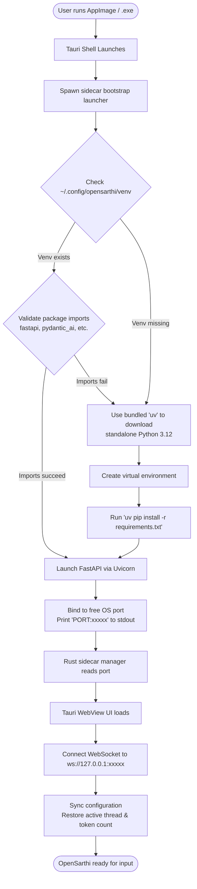

---

## 2. Top-Level Message Flow

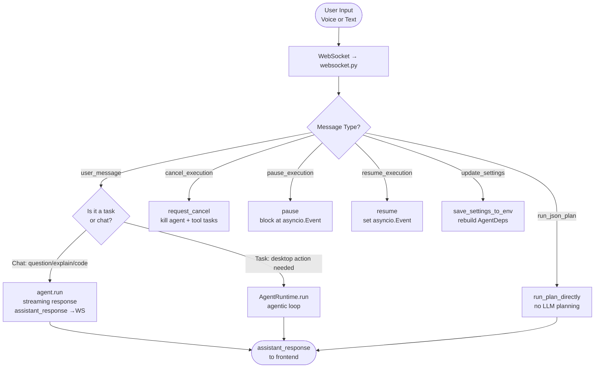

---

## 3. How the Agent Decides: Chat vs. Task

The LLM itself makes the classification decision based on the system prompt instructions.

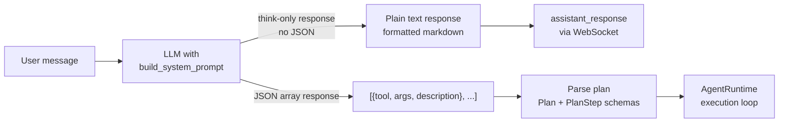

> **Key:** If `desktop_automation` skill is **not** selected, the JSON tool-call format is removed from the prompt entirely — the LLM cannot generate task plans, keeping all responses conversational.

---

## 4. AgentRuntime Execution Loop

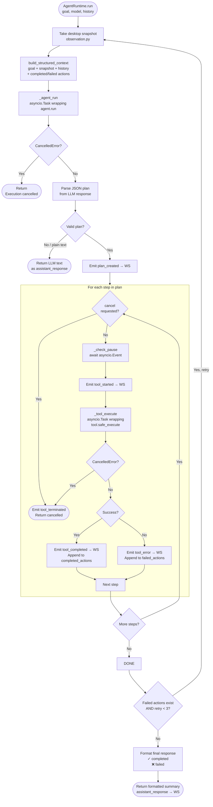

---

## 5. Cancellation & Pause Architecture

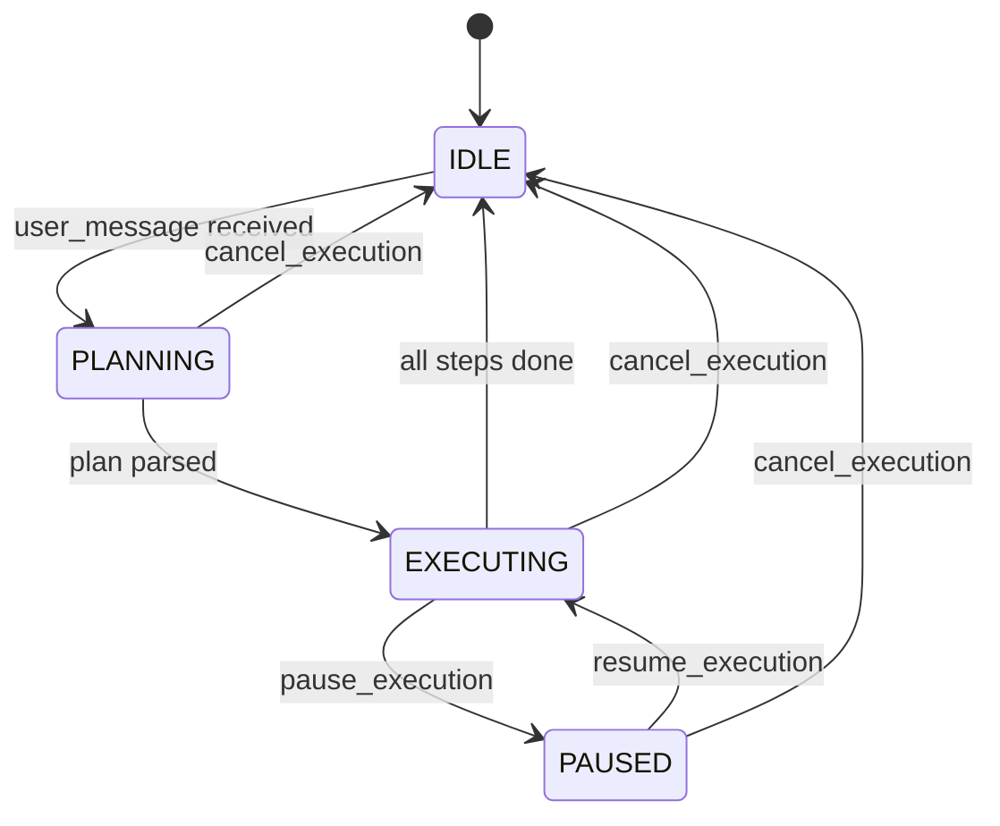

### Cancel Signal Path

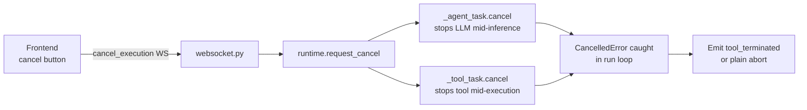

---

## 6. JSON Plan Direct Execution (Import Mode)

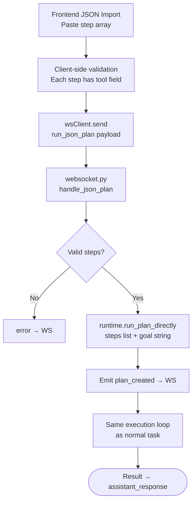

> No LLM is called. No tokens consumed. Plan executes immediately.

---

## 7. Voice Input Pipeline

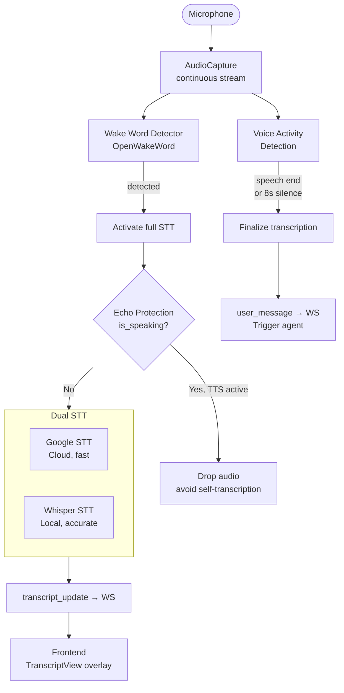

---

## 8. Personalization → Prompt Pipeline

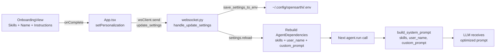

### Skill → Prompt Feature Matrix

| Skill Selected | Effect on Prompt |
|---------------|-----------------|
| `desktop_automation` | JSON tool-call format + tool rules enabled |
| `developer` | Code quality hints, prefer terminal commands |
| `system_admin` | Direct shell command preference |
| `media` | Spotify/YouTube/media control guidance |
| `writing` | Text quality, multiple variants hint |
| `research` | Thorough analysis, source citation guidance |
| `web` | open_app → wait_for_window → type_text flow hint |
| `privacy` | Prefer local processing, data exposure warnings |
| None of above | Standard conversational response only |

---

## 9. Settings Sync Flow

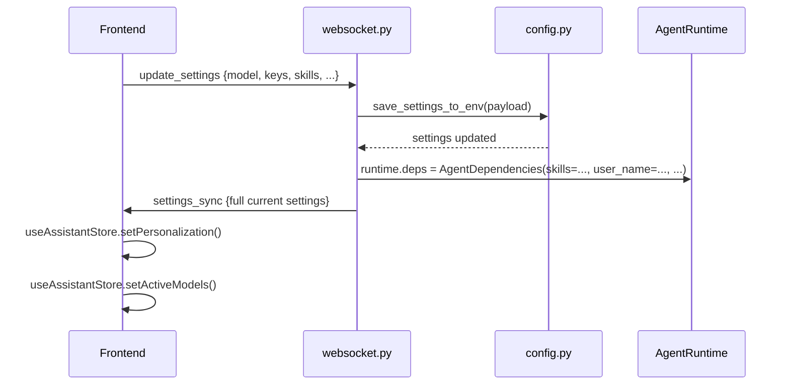

---

## 10. Token Tracking Flow

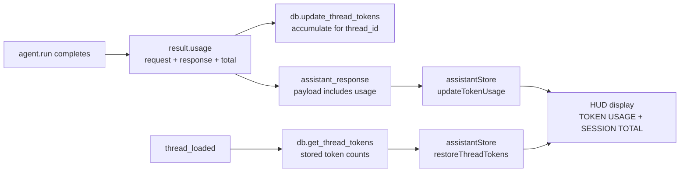
